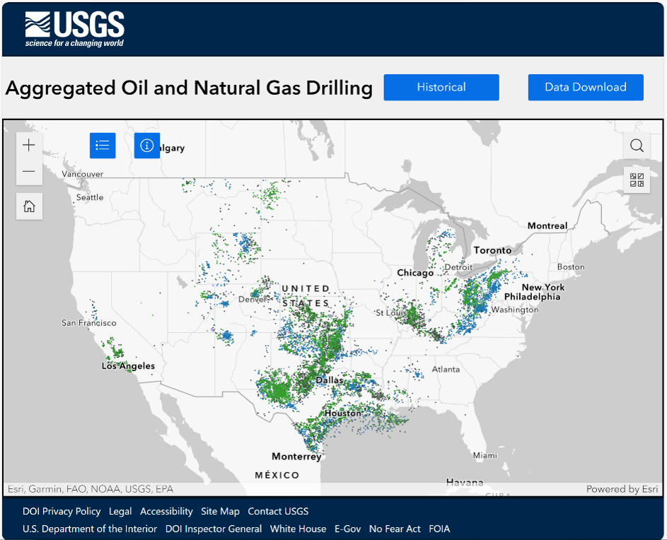
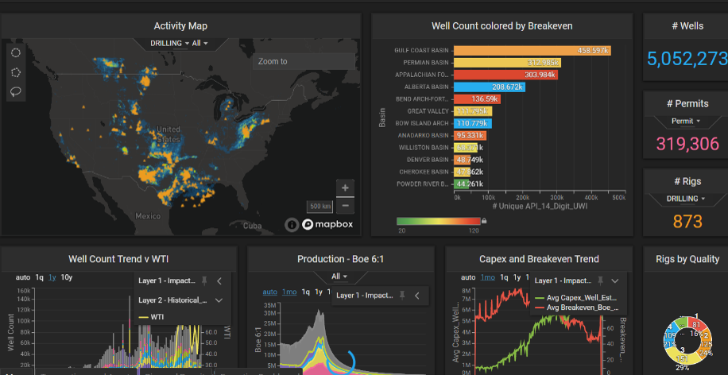
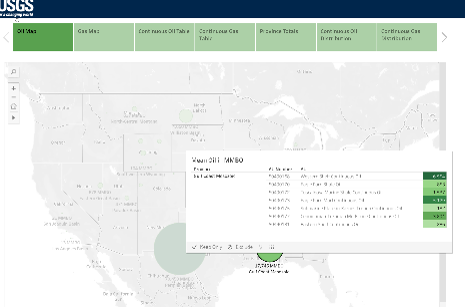
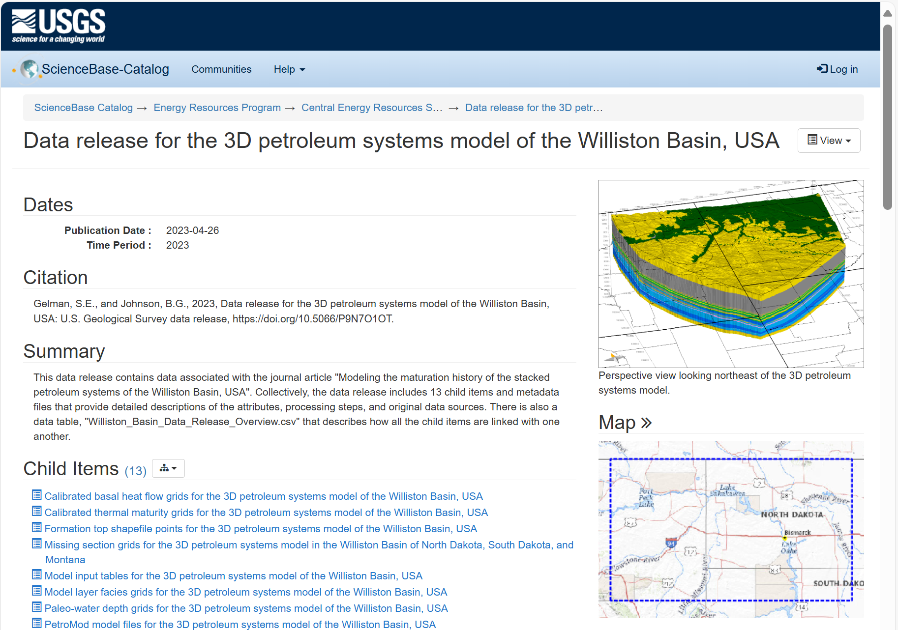

# Christopher C. Skinner – Petroleum Data Integration Lead – Portfolio

Primary lead for ingestion, normalization, and QA/QC of well data across U.S. states, Canada, and select international regions. Guided internal teams, advised on best practices, and built reusable workflows integrating geoscience and analytical tools for accurate, analysis-ready datasets.

---

## 📍 Aggregated Oil and Gas Drilling and Production History 

**Role:** Lead Data Architect
**Summary:** Designed and implemented ETL pipelines to ingest well and production datasets from Snowflake for all U.S. states. Data was spatially and temporally binned, normalized, and validated through comprehensive QA/QC procedures. Collaborated extensively with vendors and internal users to capture requirements and address data quality issues.
- 🔗 [Web Viewer](https://certmapper.cr.usgs.gov/data/apps/oil_gas_cells/)  
- 📄 [Data Release (DOI)](https://doi.org/10.5066/P9UIR5HE)  
- 🐍 [Python Script](https://github.com/kingshorthair/resume/blob/main/production_aggregation.py)

---

## 🗂️ Internal Data Catalogs & Integration Workflows  

**Role:** Lead Architect and Coordinator   
**Summary:** Built internal catalogs for well log, seismic, and geochemistry datasets. Integrated vendor data (e.g., SP Global) and public data sources into internal workflows, ensuring data quality, consistency, and scalability. Managed multi-millon dollar vendor contracts and provided technical guidance to internal teams on queries, normalization, and anomaly detection. Utilized Python, C#, SQL and other tools. 

---

## 🧭 Public-Facing Applications & Data Tools 

**Role:** Data Engineer and Stakeholder Liaison  
**Summary:** Delivered a suite of public-facing applications and analytical tools, including dashboards, map-based interfaces, and story maps. Ensured datasets were accurate, normalized, and aligned with user workflows. Collaborated closely with analysts, developers, and stakeholders to make energy data interactive, reliable, and accessible for both internal teams and the public. 
- 🗺️ [Orphaned Well Story Map](https://certmapper.cr.usgs.gov/data/apps/orphanedwell_waterquality/)  
- 🔗 [Hydrogen Prospectivity Application](https://certmapper.cr.usgs.gov/data/apps/hydrogen/)  
- 📊 [USGS Continuous Assessments Dashboard](https://certmapper.cr.usgs.gov/data/apps/noga-summary/)  
- 📰 [USGS World Oil and Gas Assessments](https://certmapper.cr.usgs.gov/data/apps/world-energy/)
- 🧾 [NPR-A Seismic Archive Viewer](https://certmapper.cr.usgs.gov/data/apps/npra/)

---

## 🔁 Energy Program Data Release Platform  

**Role:** System Owner for Data Lifecycle, Metadata Governance, and DOI Management  
**Summary:** Oversaw the end-to-end pipeline for releasing energy datasets from internal teams to the public. Implemented rigorous multi-stage review processes, including automated QA checks, peer review, and metadata verification. Developed workflows to detect duplicates, outliers, and schema inconsistencies, and maintained FGDC-compliant metadata for traceability and reproducibility. Facilitate released 1000's of data sets including basin models, well logs, seismic, geochemistry, formation depths/thicknesses. 
- 📄 [3D Petroleum System Model (Sample Release)](https://doi.org/10.5066/P9N7O1OT)  
- 📚 [Current Release Catalog](https://www.sciencebase.gov/catalog/folder/59cab03de4b017cf314094df)  
- 🗃️ [Legacy Archive](https://www.sciencebase.gov/catalog/folder/601c5893d34e94a4b9fc2742)

---

## 👋 About Me

You’ve reached the end — but it’s just the start. Let’s connect and explore how we can make your energy data more accurate, accessible, and actionable.

- 🔗 [LinkedIn](https://www.linkedin.com/in/chriscskinner/)
- 📄 [Resume (PDF)](./resume.pdf)
- 📬 [Email](mailto:kingshorthair@gmail.com)
